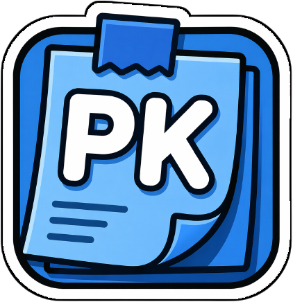

# PK Sticky Notes

[🇬🇧 EN](README_en.md) · [🇫🇷 FR](README.md)

✨ Add sticky notes directly to your web pages.

## ✅ Features
- **Sticky Notes**: Create notes on any website.
- **Persistence**: Notes are saved using the Chrome storage API.
- **Configuration**: Customize the extension via the options page.
- **Context Menu**: Quick access to features via the right-click menu.

## 🧠 Usage
1. Click the extension icon to create a new note.
2. Use the context menu (right-click) to interact with the notes.

## ⚙️ Settings
Access the options page (`options.html`) to modify extension settings.

## 🧪 Install
1. Open Chrome and navigate to `chrome://extensions/`.
2. Enable **Developer mode** in the top right.
3. Click **Load unpacked**.
4. Select the `src` folder of this project.

## 🧾 Changelog
- 1.0.1: README + version bump.
- 1.0.0: Initial release.

## 🔗 Links
- FR README: [README.md](README.md)
